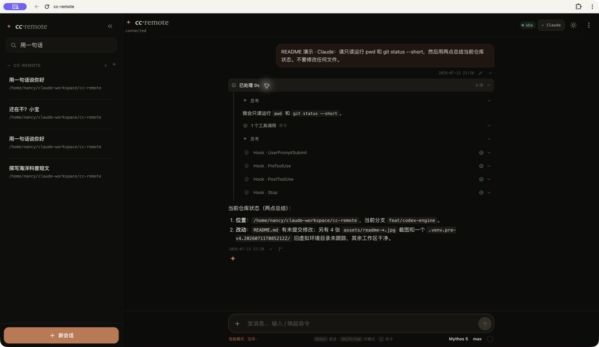
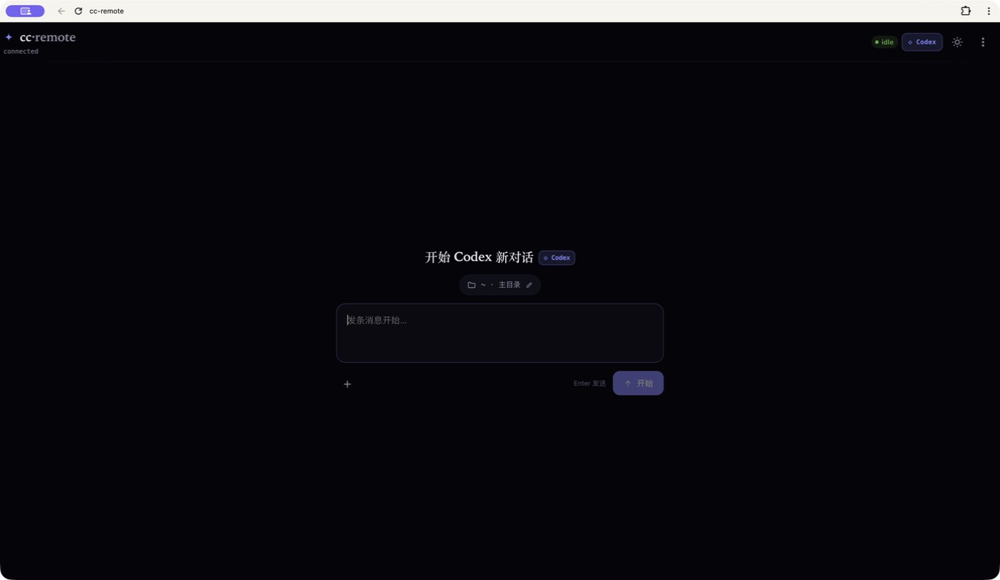
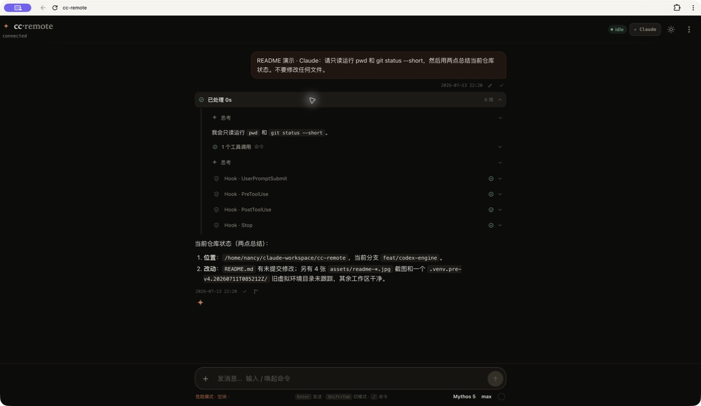

# cc-remote native pager

**让手机和任意浏览器操控你机器上的 Claude Code / Codex。**

自托管 · 双引擎 · 多会话 · 实时进程 · 响应式 Web

**当前版本：v3.0.0** · 发行版 `3.0.0-pager.5` · Wire protocol v19

[English](README_en.md) ·
[旅程一：局域网内 Windows + Android](#旅程一局域网内-windows--android) ·
[旅程二：远程访问](#旅程二https-中继--wrapper-远程访问) ·
[安全须知](#安全须知请先阅读) ·
[更新日志](CHANGELOG.md) ·
[上游来源](docs/UPSTREAM.md)

cc-remote 是一个开源远程控制平面。本地 `wrapper` 驱动已安装并登录好的
`claude` / `codex` 命令行，浏览器通过你自托管的 WebSocket 中继查看和控制其
会话。模型、鉴权与工具执行始终停留在本地 CLI 一侧；cc-remote 不代理模型
API，也不把 API Key 写入 Web 客户端。

本仓库同时提供一个原生 **Android pager**（`dev.ccremote.lan`）：一个 WebView
统一持有鉴权、WebSocket 传输和聊天界面，Jetpack Compose 仪表盘通过受
exact-origin 限制的桥接层投影会话状态。不存在第二套会话状态机。

v3.0.0 不是一次视觉改版。它在既有的双引擎、多会话远程控制平面之上新增了
独立的 Code / Work 空间，并重构了历史投影、原生客户端协调、多设备路由和
发布边界。这些工作针对的是超长会话、App/CLI 状态陈旧、移动端历史跳变和跨
机器串扰等真实故障。




---

## 目录

- [v3 架构升级](#v3-架构升级)
- [前置条件](#前置条件)
- [旅程一：局域网内 Windows + Android](#旅程一局域网内-windows--android)
- [旅程二：HTTPS 中继 + wrapper 远程访问](#旅程二https-中继--wrapper-远程访问)
- [架构](#架构)
- [环境变量](#环境变量)
- [鉴权模型](#鉴权模型)
- [可靠性边界](#可靠性边界)
- [运维](#运维)
- [安全须知（请先阅读）](#安全须知请先阅读)
- [发布维护者](#发布维护者)
- [开发](#开发)
- [FAQ](#faq)
- [许可证](#许可证)

---

## v3 架构升级

v3 把 cc-remote 从“在浏览器里控制一个 CLI”推进到本地优先、可恢复、可安全连接
多台机器的控制平面。与上一公测版相比，主要变化：

| 领域 | v3.0.0 |
|---|---|
| **Code / Work 空间** | 在仓库导向的 Code 会话旁新增独立的 Cowork 界面。Claude 与 Codex 各自获得私有项目、文件/链接/笔记知识源、可复用模板、日程和产物。Work 与 Code 在目录、会话、基础提示词和权限边界上相互隔离。 |
| **历史启动与超长会话** | 浏览器先绘制上次经校验的 IndexedDB 投影。wrapper 上带源码指纹的 SQLite 索引先返回最近几轮摘要，工具输出、推理、进程日志和超大文本按需按轮加载。短会话不再等待全量源码扫描；长会话可以向前翻页而不丢失阅读视口。 |
| **超大 Codex rollout** | Codex 历史按轮反向读取，同时保留 app-server 原生 resume 与 compact 状态；cc-remote 从不把整个 rollout 重新上传给模型。仅对“Codex Desktop + OpenAI 超大 resume”这一种情况走严格受控的官方 HTTP 兼容路径。 |
| **原生 App / CLI 协调** | Claude CLI/Desktop/Agent View 与 Codex 共享 daemon/App/CLI 各自保留引擎原生的所有权模型。v3 协调 running、read-only、interrupt、steer、compact、turn 绑定和终端状态，使兄弟会话不再互相锁死、旧轮次不会挪到尾部、被打断的工作不残留幽灵活动。 |
| **多设备隔离** | 设备中心新增一次性配对、可独立吊销的机器凭证和在线状态。中继只路由账号允许的 `machine_id`。设备、Code/Work、引擎、连接代际和会话归属互相隔离，迟到的帧不会改写到当前视图。 |
| **移动端与产物体验** | 加载更早历史时保留滚动锚点。图片按需加载，支持灯箱、点按关闭和双指缩放。Markdown、源码、HTML、PDF、Office 预览保持在本地安全边界内。PWA 图标、窄屏抽屉、错误呈现和进程时间线同步对齐。 |
| **可回滚发布** | 产品版本 v3.0.0，Wire protocol v19。构建与部署双向校验这两个值。VPS 使用不可变发布、发布本地虚拟环境、原子 `current` 切换和回滚，而不是覆盖正在运行的目录。 |

> **信任边界没有改变：** 模型账号、API Key、会话来源和工具执行都在 wrapper
> 机器上。VPS 中继不存储任何会话或产物。浏览历史只读取本地 transcript、
> rollout 和可重建投影；它从不 resume 引擎，也不产生模型轮次。

完整发布说明与升级要求见 [CHANGELOG.md](CHANGELOG.md)。

## 前置条件

cc-remote **不会替你安装或登录代理 CLI。** 无论走哪条旅程，你都必须先有可用
的 **Claude Code** 和/或 **Codex CLI**，且已登录、能在自己的终端里正常对话：

- **Claude Code** — 一个已登录、在终端里能应答的 `claude`。
- **Codex CLI** — 一个已登录、其 `app-server` 能启动的 `codex`。

wrapper 驱动这些既有安装，绝不替代它们。模型凭证和模型 API 留在代理机器上；
cc-remote 只通过你自托管的中继搬运控制链路（会话视图 + 指令）。

Office 产物预览（DOCX/XLSX/PPTX → PDF）另需在 wrapper 主机安装 **LibreOffice**。
其他场景均为可选项。

---

## 旅程一：局域网内 Windows + Android

最快的完整体验：**Windows 机器**同时运行中继和 wrapper（以 Windows 服务或便携
压缩包形式），同一局域网内的 **Android 手机**运行原生 pager（`dev.ccremote.lan`）
或响应式 Web 客户端。不需要公网 VPS、域名或 TLS——流量停留在局域网内。

```
Android pager / 手机浏览器 ──http://<windows-lan-ip>:8765──▶ Windows 中继+wrapper
                                                                  └─ 驱动本地 claude / codex
```


### 1) 安装 Windows 发行版

> **[GitHub Releases：下载 Windows x64 一键安装包（`*-windows-x64-setup.exe`）](https://github.com/hongjunmu79-debug/cc-remote-native-pager/releases)**
> · [从同一 Release 下载对应的 `*-windows-x64-setup.exe.sha256`](https://github.com/hongjunmu79-debug/cc-remote-native-pager/releases)

> **源码与安装包必须匹配：** 本 README 可能先于安装包发布更新。仅使用发布信息
> 明确包含（或构建自）你准备部署的源码 SHA 的 Release；不能根据当前 README
> 把尚未发布的分支功能归因于旧 Release 资产。

在只放有本次下载文件的目录中，校验同一 Release 的 `.exe` 与 `.sha256`：

```powershell
$setup = @(Get-Item .\cc-remote-v*-windows-x64-setup.exe)
if ($setup.Count -ne 1) { throw "expected exactly one setup.exe" }
Get-FileHash -LiteralPath $setup[0].FullName -Algorithm SHA256
Get-Content -LiteralPath "$($setup[0].FullName).sha256"
```

双击安装包即可。便携版仍在同一 Release 提供，解压后运行 `start-portable.ps1`。
安装器会：

- 安装到你选择的目录（无固定路径）；
- 生成强随机的 `SESSION_SECRET` 与 `WRAPPER_TOKEN`；
- 自动采用本机名、可用工作区和局域网地址作为默认配置，不要求设置登录密码；
- 检测 `claude` 与 `codex`，不复制它们的凭证；
- 以仅限当前用户的 ACL 写入配置，并拒绝占位值；
- 注册定时任务监督长驻的中继/wrapper 进程，带有限的失败重启；
- 在所选端口创建仅限 `LocalSubnet` 的防火墙规则；
- 创建开始菜单和桌面「cc-remote 控制台」快捷方式，安装完成后自动打开；
- 升级时保留既有配置，支持干净卸载/回滚，不触碰 Claude/Codex 会话与凭证。

无人值守安装可通过传入配置文件完成。详见
[packaging/windows/README.md](packaging/windows/README.md)。

### 2) 打开控制台并显示配对二维码

安装结束会自动打开本机控制台；以后可双击桌面或开始菜单里的「cc-remote
控制台」。点击「显示扫码配对二维码」。二维码为一次性、短时凭据，绑定当前
`machine_id` 与新客户端；relay 只保存其摘要，二维码过期、使用或 relay 重启后失效。

中继 origin 通常是 `http://192.168.1.23:8765/`。可在另一台机器上验证：

```bash
curl http://<windows-lan-ip>:8765/healthz
# 期望: {"ok":true,"wrapper_connected":true,"clients":0}
```

### 3) 安装并打开 Android pager

1. 构建或下载 Android APK（见下方 Android 说明），安装并启动。
2. 点「扫码」，扫描 Windows 控制台显示的二维码。
3. App 自动校验 relay origin、兑换 HttpOnly 会话 cookie、保存服务器与设备作用域，
   随后直接进入会话；无需输入域名或密码。手工地址与密码登录仅作为后备。
4. WebView 持有登录/WebSocket/聊天；原生仪表盘通过桥接层投影同一会话状态。
   保持单一会话状态机。

### 4) （纯 Web 替代方案）使用响应式 Web 客户端

在局域网任意浏览器打开 `http://<windows-lan-ip>:8765/` 并登录。Web 客户端可
作为 PWA 安装，在手机上同样可用；原生 pager 在其之上增加受限仪表盘投影。

### 5) 本机单机快速开始（源码检出）

单机、已装 Python + Node 的情况下：

```bash
git clone https://github.com/hongjunmu79-debug/cc-remote-native-pager.git
cd cc-remote-native-pager

python3 -m venv .venv && source .venv/bin/activate   # Windows: .venv\Scripts\activate
pip install --require-hashes --only-binary=:all: -r requirements.lock

npm --prefix web ci
npm --prefix web run build          # 产出 web/dist/

install -m 600 .env.example .env    # Windows: copy .env.example .env
```

编辑 `.env` —— 至少：

```ini
SESSION_SECRET=<openssl rand -hex 32>
WRAPPER_TOKEN=<openssl rand -hex 32>
PUBLIC_ORIGIN=http://127.0.0.1:8765
WEB_STATIC_DIR=web/dist
CC_CWD=C:\path\to\your\project
```

两个终端分别运行：

```bash
python -m cc_remote.relay          # 提供 web + /ws + /api
python -m cc_remote.wrapper        # 驱动本地 claude / codex CLI
```

然后在 relay 主机打开 `http://127.0.0.1:8765`，显示二维码并用新设备扫码。
如需密码后备，可额外设置 `LOGIN_PASSWORD=<强密码>`；多用户部署可设置
`LOGIN_USERS_JSON`。



> 局域网使用（浏览器或 Android pager 访问非回环 IP）时，设置
> `RELAY_HOST=0.0.0.0` 和 `PUBLIC_ORIGIN=http://<lan-ip>:8765`，并确保防火墙允许
> 该端口在局域网子网内通信。Windows 发行版已为你完成这些配置。

---

## 旅程二：HTTPS 中继 + wrapper 远程访问

把中继放到**公网 VPS** 上并绑定域名（Caddy 自动申请 TLS），wrapper 留在代理
机器上（或留在 Windows 机器上），从任何地方通过 `wss://` 访问。

```
代理机器 wrapper ──wss:443──▶ Caddy(VPS, 自动 HTTPS) ──▶ relay(127.0.0.1:8765) ◀──wss:443── 手机浏览器
                                                                    └─ 同源提供 web/dist
```



### 1) 下载并校验引导脚本

在 GitHub 上确认版本与发布声明，从同一 Release 下载 `install.sh` 与
`SHA256SUMS`：

```bash
release=https://github.com/hongjunmu79-debug/cc-remote-native-pager/releases/download/v3.0.0-pager.5
curl -fLO "$release/install.sh"
curl -fLO "$release/SHA256SUMS"

# Linux
grep ' install.sh$' SHA256SUMS | sha256sum -c -
# macOS 使用:
# grep ' install.sh$' SHA256SUMS | shasum -a 256 -c -
chmod +x install.sh
```

引导脚本检测 OS/CPU，只下载所选角色产物，并在解压/执行前校验 SHA-256。

### 2) 在 VPS 安装 Relay

把域名的 A/AAAA 记录指向 VPS，开放 80/443 端口，然后运行：

```bash
./install.sh relay --domain remote.example.com
```

Linux 下脚本会自行请求 `sudo`。首次安装会交互式询问至少 16 位的 Web 密码，
生成 Relay 密钥，安装 Caddy/systemd，并在 `/opt/cc-remote/releases/` 下执行
不可变暂存、原子 `current` 激活和回滚。既有 `/opt/cc-remote/.env` 会被保留。

打开 `https://remote.example.com/` 登录，在设备中心选择 **Allow adding devices**，
复制一次性配对码。

### 3) 在运行 Claude / Codex 的机器上安装 Wrapper

先确保原生 `claude` 或 `codex` CLI 已登录且可用，然后运行：

```bash
./install.sh wrapper \
  --relay https://remote.example.com \
  --pair XXXXX-XXXXX-XXXXX-XXXXX \
  --name "Desktop"
```

macOS 请以桌面登录用户身份运行安装器；它创建用户级 LaunchAgent。Linux 会请求
`sudo`，但 Wrapper 及其所有模型/工具子进程仍以启动安装的普通用户身份运行。
长效设备凭证只以 `0600` 权限的私有配置存储，绝不写入 plist、systemd unit 或
发布目录。

升级时下载新版本的 `install.sh` 重跑即可。Relay 仍需 `--domain`；已配对的
Wrapper 只需：

```bash
./install.sh wrapper
```

在同一个维护窗口内完成 Relay、Web 和所有 Wrapper 的完整协议升级，然后强制刷新
打开的浏览器标签页。安装器保留上一发布；若激活后未变健康，会同时恢复
`current` 和服务定义。

### 4) 远程使用 Android pager

首次启动时输入 `https://remote.example.com/`。HTTPS 根 origin 总是被接受；
WebView 以与局域网完全相同的方式持有登录/WebSocket/聊天。公网明文 HTTP 按设计
拒绝。

### 5) 手动生成 token（源码暂存路径）

源码暂存/手动路径仍可用于开发、自定义部署和故障恢复：

```bash
openssl rand -hex 32   # WRAPPER_TOKEN（relay 与 wrapper 必须一致）
openssl rand -hex 32   # SESSION_SECRET（relay）
# 可选：另设 LOGIN_PASSWORD（Web 密码后备）或 LOGIN_USERS_JSON（多用户后备）
```

构建 Web 客户端并把暂存目录上传到 VPS，然后运行
`deploy/setup-vps.sh your-domain.com ~/cc-remote-upload`。安装器构建不可变发布 +
venv，原子切换 `/opt/cc-remote/current`，失败时连同 Caddyfile 和中继 unit 一起
回滚。详见 [deploy/README.md](deploy/README.md)。

验证：

```bash
curl https://remote.example.com/healthz
# 期望: {"ok":true,"wrapper_connected":false,"clients":0}
```

---

## 架构

两条**独立**链路：

```
模型链路（cc-remote 从不触碰）：  claude / codex ──(本地配置)──▶ 模型服务

控制链路（本仓库）：            浏览器 ⇄ 中继(WebSocket) ⇄ wrapper ⇄ SDK / app-server ⇄ 本地 CLI
```

| 组件 | 运行位置 | 作用 |
|---|---|---|
| **wrapper** | 运行 `claude` / `codex` 的机器 | 持有会话池，把 SDK/app-server 事件翻译成 wire protocol，处理 interrupt/drain，按需读取 transcript/rollout 历史，并在本地临时转换 Office 预览。**只主动连接中继，无需入站端口。** |
| **relay** | 公网 VPS（或局域网机器） | 纯 WebSocket 转发器（FastAPI）。每个 `machine_id` 一个 wrapper 槽位；浏览器使用 HttpOnly 会话 cookie，只接收其选中机器的事件。**不持久化会话或产物，从不 import `claude-agent-sdk`，绝不触碰模型 API。** |
| **web** | 浏览器 / Android WebView | React 客户端；中继从同一 origin 提供其静态文件（`web/dist`）。 |
| **Android pager** | 手机 | Jetpack Compose 对 web reducer 状态的受限投影，经 exact-origin WebMessage 桥。一个 WebView 持有鉴权/WebSocket/聊天。 |

### 原生终端与 Remote 如何协作

Code 会话遵循各 CLI 的真实控制平面，不替换官方命令：

- **Claude：** `claude` 始终是官方命令、官方 TUI；cc-remote 不安装 alias、
  shim 或 PATH 拦截。由 `claude`、Claude Desktop 或 Agent View 直接打开的会话
  默认在 Remote 中为只读镜像。若要从 Remote 写入，用户显式选择接管；
  cc-remote 只向同一用户的同一 Claude 进程身份发送 SIGTERM，等待释放后通过
  SDK resume 同一会话。
- **Codex Code：** 优先使用 Codex 官方共享 app-server daemon，让原生 Codex
  客户端与 Remote 共享线程和控制状态。若已装版本无法提供，cc-remote 显式回退
  到私有 app-server。排查时可设 `CC_REMOTE_CODEX_DAEMON=off`。
- **Work：** Claude 与 Codex 的 Work 使用私有进程和目录，不加入 Code 控制平面。

### 产物预览在哪里执行

- HTML 在浏览器内用 DOMPurify 消毒，在无脚本、禁网络的沙箱 iframe 中渲染。
- PNG/JPEG/GIF/WebP/AVIF 与 PDF 由 wrapper 校验路径、类型和大小，再仅经已鉴权
  WebSocket 返回给请求的浏览器。
- DOC/DOCX/ODT/RTF、XLS/XLSX/ODS、PPT/PPTX/ODP 由 **wrapper 主机**上的
  LibreOffice 转为 PDF。Linux 上 bubblewrap 移除网络与用户目录访问。转换后目录
  立即删除。
- 中继只转发受限预览帧，不存储原始文件也不存储转换产物。


---

## 环境变量

**Relay**

| 变量 | 默认 | 说明 |
|---|---|---|
| `RELAY_HOST` / `RELAY_PORT` | `127.0.0.1` / `8765` | 监听地址（生产环境在 Caddy 之后——保持 127.0.0.1；局域网设 `0.0.0.0`）。 |
| `LOGIN_PASSWORD` | 空 | 可选单用户 Web 密码后备；正常新客户端通过一次性二维码配对。 |
| `LOGIN_USERS_JSON` | 空 | 可选多用户策略；取代 `LOGIN_PASSWORD`。 |
| `SESSION_SECRET` | 空 | 签名会话 token 的 HMAC 密钥。**必填**（`openssl rand -hex 32`）。 |
| `PUBLIC_ORIGIN` | 空 | 允许连接的浏览器精确 origin，例如 `https://remote.example.com`；**必填**，非回环 origin 必须使用 HTTPS，除非启用 `ALLOW_INSECURE_HTTP`。 |
| `ALLOW_INSECURE_HTTP` | `0` | 裸公网 IPv4 的逃生口。默认关闭；启用时凭证和全部会话流量明文传输。优先 TLS。 |
| `WRAPPER_TOKEN` | 占位 | 单机/兼容模式的 wrapper Bearer token；除非设置了 `WRAPPER_TOKENS_JSON`，否则必填。 |
| `WRAPPER_TOKENS_JSON` | 空 | 可选机器绑定 token；取代 relay 的通配 `WRAPPER_TOKEN`。 |
| `WEB_STATIC_DIR` | 空 | 指向 `web/dist` 以同源提供 Web 客户端；空 = 仅 API/WS。 |
| `DEVICE_PAIRING_TTL_SECONDS` | `600` | 一次性配对码的有效秒数。 |

**Wrapper**

| 变量 | 默认 | 说明 |
|---|---|---|
| `RELAY_URL` | `ws://127.0.0.1:8765/ws` | 中继 WebSocket URL（生产环境 `wss://domain/ws`）。 |
| `WRAPPER_TOKEN` | `change-me-wrapper` | 与 relay 相同。 |
| `CC_REMOTE_MACHINE_ID` | `default` | 多机器 relay 上的稳定路由 id。 |
| `CC_CWD` | cwd | 新会话的默认工作目录；**必须正确**，否则 Claude `--resume` 找不到。 |
| `CC_REMOTE_CODEX_DAEMON` | `auto` | Code 优先用 Codex 官方共享 daemon；`off` 强制私有 stdio app-server。 |
| `MAX_CONCURRENT_SESSIONS` | `20` | 常驻代理子进程上限。 |
| `CLAUDE_WORK_ROOT` | `~/.claude/cc-remote/work` | 私有 Claude Work 根。 |
| `CODEX_WORK_ROOT` | `~/.codex/cc-remote/work` | 私有 Codex Work 根。 |

每条消息最多 8 个附件，每个最多 6 MiB、解码后合计最多 8 MiB；超限输入在模型
轮次开始前即被拒绝。

---

## 鉴权模型

- **Web/Android 客户端：** relay 本机控制台或已有会话签发一次性、短时、
  `machine_id/client_id` 作用域的 QR JSON；`POST /api/client-pairing/redeem` 消费后
  创建 HMAC 会话，写入 **HttpOnly、SameSite=Strict** cookie。二维码 token 不进 URL，
  使用后立即失效。`POST /api/login` 仅保留为可选密码后备。
  WebSocket 还必须通过精确 `Origin` 校验。
- **wrapper ⇄ relay：** WS 握手携带机器凭证。手动部署用 `WRAPPER_TOKEN` /
  `WRAPPER_TOKENS_JSON`；设备中心签发独立、机器绑定、可单独吊销的凭证。relay
  只存其哈希，且任何凭证不得宣告其他设备的 `machine_id`。
- **Android pager：** 内嵌 WebView 共享同一浏览器会话。原生桥限制为精确配置的
  origin；外部链接在系统浏览器打开且无桥接权限。
- Token 只出现在 cookie/header 中，绝不进 URL 或 wire-protocol 消息体；日志对
  token/密码字段脱敏。

---

## 可靠性边界

- Web 与 TUI 给可重试命令绑定稳定 `cmd_id`，socket 重连或 wrapper 恢复后重发。
  wrapper 在同一个 wrapper 进程生命周期内去重并 ACK 完成。
- 未确认命令队列与通用命令去重表是**有界内存态**。硬刷新、TUI 退出或 wrapper
  崩溃不承诺跨进程 exactly-once。
- 持久化的 Claude transcript 与 Codex rollout 是历史的唯一事实来源。wrapper
  SQLite 摘要索引与浏览器 IndexedDB 是可重建投影；live ring 只提供有界的重连补
  播。
- Work 日程是例外：日程、运行记录、租约、心跳、重试和下次运行时间均存于
  SQLite。

---

## 运维

### 日志

- **Linux/macOS：** `journalctl -u cc-remote-wrapper -f`、
  `journalctl -u cc-remote-relay -f`（VPS）；macOS 用 `log show --predicate`。
- **Windows：** 发行版定时任务把 JSON 日志写到安装目录 `logs/` 下；开发时
  `Get-Content -Wait logs\wrapper.log`。

### 健康检查

- Relay：`curl <origin>/healthz` → `{"ok":true,"wrapper_connected":...}`。
- Wrapper 日志出现 `connected to relay` / `wrapper running`。
- Android pager：仪表盘横幅显示桥/wrapper 状态。

### 升级

1. 停止 wrapper（或让发行版定时任务处理重启窗口）。
2. 在同一维护窗口部署新 Relay + Web 包（VPS）和新 Wrapper（代理机器）；
   硬刷新已打开的浏览器。
3. Windows 上用新安装器覆盖安装——配置会被保留。

### 回滚

- Linux/macOS 发布保留上一发布目录；激活失败时安装器恢复 `current` 与服务定义。
- Windows 保留上一安装树；`uninstall.ps1 -Restore <version>` 可恢复先前快照。
- Android APK 拒绝 version code 降级；先回滚 Web 包，再发布更新的 APK。

### 卸载

- Windows：在安装目录运行 `uninstall.ps1`。它会删除定时任务、LocalSubnet
  防火墙规则和安装文件，但**绝不删除 `~/.cc-remote`、Claude transcript、Codex
  rollout 或 CLI 凭证**。
- Linux/macOS：安装器 `--uninstall` 路径移除服务与 release 软链，保留设备凭证
  和会话来源。

### 常见故障恢复

| 症状 | 恢复 |
|---|---|
| `protocol v19` 门槛报错 | Relay/Web/Wrapper 版本混用。全部升级到同一发行版并硬刷新。 |
| Android pager 没有任务 | 先在 Web 聊天里登录一次；WebView 持有会话。 |
| wrapper 找不到 `claude`/`codex` | 设置 `CLAUDE_BIN` 或调整 PATH；两个 CLI 都必须已登录。 |
| 防火墙挡了局域网访问 | 确认 Windows 规则在所选端口上限定为 `LocalSubnet`。 |
| 连接循环重置 | 检查 `RELAY_URL`/`PUBLIC_ORIGIN` 是否匹配，再看日志中 drain/超时。 |

---

## 安全须知（请先阅读）

> **cc-remote 让远程的人能在你的机器上执行任意命令。把它当成把 shell 交给
> 别人。**

- Code 会话仍是远程开发控制平面：Claude 默认 `permissionMode:
  bypassPermissions`，Codex 默认审批策略 `never` 并继承机器的 Codex sandbox
  配置。**任何能登录并进入 Code 的人都视为持有 wrapper 机器的远程代理/shell
  权限。** Work 使用独立私有根目录，不暴露外部目录。
- 一次性客户端配对、可选的 `LOGIN_PASSWORD` / `LOGIN_USERS_JSON`、
  `WRAPPER_TOKEN` / `WRAPPER_TOKENS_JSON` 和 `SESSION_SECRET` 构成鉴权边界：
  使用强随机值，绝不提交到仓库或粘贴进聊天，
  并定期轮换。仓库里的 `.env` 仅供本地开发；生产 wrapper 必须使用仅 root 可读
  的环境文件。
- 生产环境务必使用 TLS（`wss://`）。只在临时裸公网 IPv4 部署时才设
  `ALLOW_INSECURE_HTTP=1`。
- **局域网 HTTP 仍是明文。** 在可信局域网里它是便利而非安全边界。任何能嗅探
  局域网的人都能读到登录凭证和会话内容。优先用发行版防火墙的 `LocalSubnet`
  限定，别把中继暴露到局域网之外。
- 建议：按 IP 限制中继 / 只在需要时运行；默认已带登录限流（每 IP 每分钟 5 次）。

---

## 发布维护者

版本号、release tag 校验、产物组装、签名与声明见
[docs/release-hardening/RELEASE_MAINTAINER.md](docs/release-hardening/RELEASE_MAINTAINER.md)。
版本与包默认值的唯一事实来源是
[`deploy/release-metadata.json`](deploy/release-metadata.json)；任何发布前先运行
`python -m deploy.validate_release_metadata`。

---

## 开发

```
cc_remote/
  protocol.py      # pydantic wire protocol（client/relay/wrapper 都依赖它）
  config.py        # 环境变量驱动配置
  relay/           # FastAPI relay: server / auth / pairing / forward
  wrapper/         # Claude SDK + Codex app-server / pool / stream / ringbuffer / transport
web/               # React 客户端（Vite + TS）
android-native/    # Jetpack Compose pager + WebView shell
packaging/windows/ # 可复现 Windows 安装包 + 便携压缩包
tests/             # 零 token 单元测试 + e2e 脚本
deploy/            # release metadata、Caddyfile / systemd / setup-vps.sh / env 示例
```

```bash
python -m pip install -r requirements-dev.txt
pytest                              # 单元测试（无模型，零 token）
npm --prefix web run test:reliability # 纯 Web 可靠性测试
npm --prefix web run lint           # Web 静态检查
npm --prefix web run build          # Web 生产构建

# 显式 live 路径（需要运行中的 relay + wrapper，会调用模型）
CC_REMOTE_RUN_E2E=1 CC_REMOTE_E2E_SCENARIO=smoke \
  RELAY_URL=wss://remote.example/ws LOGIN_PASSWORD='...' \
  pytest -q tests/test_e2e_entry.py
```

架构笔记与贡献契约见 [CLAUDE.md](CLAUDE.md)。

---

## FAQ

- **重启 wrapper 会丢历史吗？** 持久化历史不会丢；它来自 Claude transcript /
  Codex rollout。重启会丢未确认的内存命令与 live ring。
- **重启 relay 会掉线吗？** 会短暂断开并要求重新登录。会话本身完整保留在
  wrapper 机器上。
- **能换 VPS 或迁移到新设备吗？** 可以。VPS 只提供中继和静态 Web 包。迁移
  wrapper 时复制 transcript、rollout、Work 根和 cc-remote 状态，然后重新登录
  CLI。
- **需要入站端口吗？** 不需要——wrapper 只主动连接中继。局域网场景下，Windows
  机器必须允许所选中继端口接收局域网子网的入站连接。
- **多贵？** cc-remote 本身零模型成本；浏览 / 刷新 / 查看历史不花 token。

## 许可证

MIT —— 见 [LICENSE](LICENSE)。上游来源与 pager 改造说明见
[docs/UPSTREAM.md](docs/UPSTREAM.md)。
